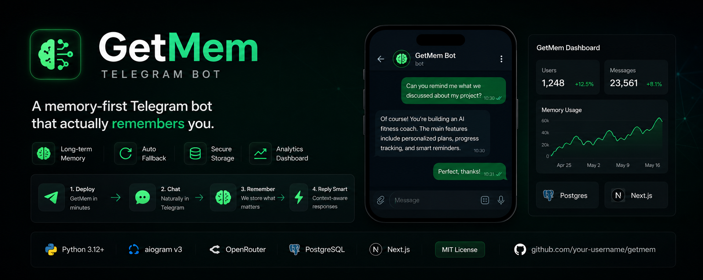

<p align="center">
  
</p>

<h1 align="center">🧠 GetMem Telegram Bot</h1>

<p align="center">
  A memory-first Telegram chat bot <b>+ Mini App</b>.<br>
  <b>aiogram v3</b> · free <b>OpenRouter</b> models with auto-fallback · long-term memory via <a href="https://getmem.ai"><b>GetMem</b></a> · Postgres · Next.js dashboard.
</p>

<p align="center">
  
  
  
  
</p>

<p align="center">
  <b>▶️ Try the live demo:</b> <a href="https://t.me/getmem_recall_bot">@getmem_recall_bot</a><br>
  <sub>Message it, send a voice note, open the dashboard — see exactly what you'll get.</sub>
</p>

---

A Telegram bot that actually **remembers you**. Every conversation is ingested
into [GetMem](https://getmem.ai); before each reply the bot recalls a compact,
ranked context about you and personalises the answer. It runs on **free**
OpenRouter models (with automatic fallback), enforces **per-user daily limits**,
sells a **premium** tier via **Telegram Stars**, understands **voice messages**,
and ships a **Telegram Mini App** where users see their usage and admins see
global stats.

> The star of the show is **memory**. The rest — bot, API, Mini App — is a
> clean, extensible template showing how to give an AI product long-term memory
> with the GetMem SDK. Drop in a key and your bot remembers its users forever.

## ✨ Features

- 🧠 **Long-term memory** — personalised replies via the GetMem SDK; `/forget` for GDPR erasure.
- 🔄 **Free models, auto-fallback** — OpenRouter's native multi-model routing via the OpenAI SDK.
- 🎤 **Voice messages** — optional [faster-whisper](https://github.com/SYSTRAN/faster-whisper) service (CPU, int8) in its own container.
- 🎚️ **Per-user limits** — free / premium daily quotas with a daily reset, in Postgres.
- ⭐ **Premium via Telegram Stars** — `/upgrade`, no external payment provider.
- 📊 **Mini App dashboard** — Next.js app: usage, history, plan; admin view for operators.
- 🧩 **Clean architecture** — ports & adapters + a DI container; depend on interfaces, swap vendors in one line.
- 🐳 **Three deploys** — local, self-managed VPS (Caddy auto-HTTPS), and Dokploy. Built with **uv**.

## 🗺️ Repository layout

```
getmem_tg_bot/
├── backend/         Python: the bot AND the Mini App API (one image, two entrypoints)
│   ├── app/
│   │   ├── core/        ports (Protocols) + ChatService + limits
│   │   ├── adapters/    OpenRouter / GetMem / transcriber implementations
│   │   ├── db/          async SQLAlchemy models + repository
│   │   ├── bot/         aiogram handlers, keyboards, texts, runner
│   │   ├── api/         FastAPI routes + Telegram initData auth
│   │   ├── container.py composition root (DI)
│   │   └── config.py
│   ├── migrations/  Alembic
│   └── vendor/getmem-ai/   vendored memory SDK
├── miniapp/         Next.js 14 Telegram Mini App (dashboard + admin)
├── transcriber/     optional faster-whisper voice service
├── deploy/          prod (Caddy) + Dokploy compose + docs
└── docker-compose.yml   local/dev stack
```

## 🚀 Quick start (local)

You need a **Telegram bot token** ([@BotFather](https://t.me/BotFather)) and a free
**OpenRouter key** ([openrouter.ai/keys](https://openrouter.ai/keys)). A
**GetMem key** ([getmem.ai](https://getmem.ai)) is optional but it's the whole
point.

```bash
git clone https://github.com/getmem-ai/getmem_tg_bot.git && cd getmem_tg_bot
cp .env.example .env          # fill BOT_TOKEN, OPENROUTER_API_KEY, GETMEM_API_KEY
docker compose up -d --build  # db + migrate + bot + api + miniapp
```

That's it — message your bot. Add voice with `docker compose --profile voice up -d --build`.

## 🏗️ Architecture

The core logic depends only on **ports** — `Protocol` interfaces in
[`backend/app/core/ports.py`](backend/app/core/ports.py): `LLMProvider`,
`MemoryStore`, `Transcriber`. Concrete **adapters**
([`backend/app/adapters/`](backend/app/adapters)) implement them against
OpenRouter, GetMem and the voice service, and everything is wired once in the
**DI container** ([`backend/app/container.py`](backend/app/container.py)). To
swap a provider, change one line in the container — call sites never move.

```
        ┌──────────── on each user message (text or voice) ─────────────┐
  voice ─► transcriber service ─► text                                   │
        │                                                                │
  text ──► MemoryStore.recall ──► GetMem ──► ranked context              │
        │                                                                │
        ▼                                                                ▼
  recent history (Postgres) ─────────► prompt ──► LLMProvider ──► OpenRouter
                                                          │
                                              assistant reply ──► user
                                                          │
        MemoryStore.remember (background) ──► GetMem ingest
```

## 💬 Commands

**Everyone:** `/start` · `/help` · `/me` (plan & usage) · `/model` (pick model) ·
`/app` (open dashboard) · `/upgrade` (Telegram Stars) · `/reset` (clear
short-term) · `/forget` (erase long-term memory).

**Admins** (in `ADMIN_IDS`): `/admin` (live panel — toggle voice, enable/disable
models, stats) · `/getprompt` & `/setprompt <text>` (view/change the bot's
system prompt) · `/stats`.

## 🎛️ Admin & runtime control

Operators can manage the bot live from Telegram — no redeploy:

- **Voice on/off** and **per-model enable/disable** (take a flaky model out of
  rotation) from the `/admin` panel. These toggles are **persisted in the
  database** (DB wins; the matching `.env` value is just the first-run default),
  so they survive restarts.
- **System prompt** (the bot's persona/domain) is stored in the **database**,
  not `.env` — edit it with `/setprompt` or from the Mini App's admin section,
  and it applies to everyone immediately. The bot reads it per request, so a
  change from the Mini App is picked up by the bot process too. It falls back to
  the `SYSTEM_PROMPT` env default when unset.

When all free models are busy/rate-limited the bot rotates through the pool and,
if none answer, shows a graceful message — nudging free users to `/upgrade` to
premium models, which are far more reliable.

## 📊 Mini App

A Next.js dashboard served as a Telegram Web App. It authenticates with Telegram
`initData` (HMAC-validated server-side — see
[`backend/app/api/auth.py`](backend/app/api/auth.py)) and shows the user their
plan, today's usage, a 14-day usage chart and recent activity. **Admins** (from
`ADMIN_IDS`) additionally get global stats. Set `MINIAPP_URL` and the bot exposes
it via the chat menu button and `/app`.

## 🗄️ Data

Postgres holds only operational state — users, tier, daily usage counters, a
short rolling chat window, payments, and editable app settings (the system
prompt) — via async SQLAlchemy with **Alembic** migrations (applied
automatically by a one-shot `migrate` service). Long-term *memory* lives in
GetMem, not here.

## 🐳 Deployment

- **Local:** `docker compose up -d --build` (polling, no domain).
- **VPS:** `deploy/docker-compose.prod.yml` — single domain, Caddy auto-HTTPS, webhook.
- **Dokploy:** `deploy/docker-compose.dokploy.yml` — env injected by Dokploy, its Traefik handles domains/TLS.

Full guide: [`deploy/README.md`](deploy/README.md).

## 🧪 Development

```bash
cd backend
uv sync                 # project-local .venv from uv.lock
uv run pytest           # unit tests (no DB/network)
uv run ruff check app tests
```

## ⚙️ Configuration

Everything is environment-driven; the full, commented list is in
[`.env.example`](.env.example). Essentials: `BOT_TOKEN`, `OPENROUTER_API_KEY`,
`GETMEM_API_KEY`, `ADMIN_IDS`, plus `POSTGRES_*`. Voice, premium pricing, model
pools, limits and the Mini App URL are all configurable.

## 📦 Memory SDK

Uses the official **GetMem Python SDK** (`getmem-ai`), vendored under
[`backend/vendor/getmem-ai`](backend/vendor/getmem-ai) until it's on PyPI so the
project builds out of the box. When it's published, drop that folder and the
`[tool.uv.sources]` entry in `backend/pyproject.toml`.

## 📄 License

[MIT](LICENSE). Built to showcase [GetMem](https://getmem.ai) — long-term memory
for AI agents.
